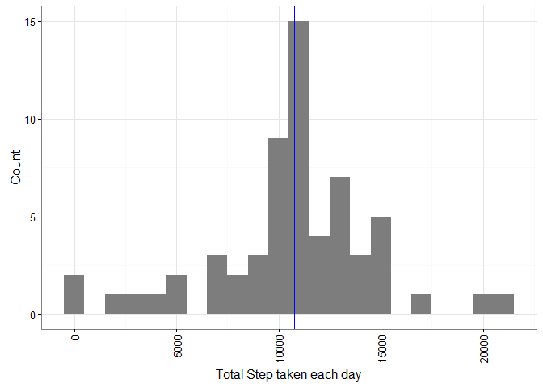

# Reproducible Research: Peer Assignment 1

## Loading and preprocessing the data 

1. Load the data


```r
  library(knitr)
  opts_knit$set(root.dir=normalizePath('./'))
  opts_chunk$set(fig.path = "./figures/")

  ## language setting for different native language.
  Sys.setlocale(category = "LC_ALL", locale = "english")
```

```
## [1] "LC_COLLATE=English_United States.1252;LC_CTYPE=English_United States.1252;LC_MONETARY=English_United States.1252;LC_NUMERIC=C;LC_TIME=English_United States.1252"
```

```r
  # set working dir
  ## setwd(paste(getwd(),"/PA1",sep=""))

  ## read CSV file
  data<-read.csv("./data/activity.csv")
  

  # check the variables
  str(data)
```

```
## 'data.frame':	17568 obs. of  3 variables:
##  $ steps   : int  NA NA NA NA NA NA NA NA NA NA ...
##  $ date    : Factor w/ 61 levels "2012-10-01","2012-10-02",..: 1 1 1 1 1 1 1 1 1 1 ...
##  $ interval: int  0 5 10 15 20 25 30 35 40 45 ...
```

```r
  # check the dataset size(dimension)
  dim(data)
```

```
## [1] 17568     3
```

2. Process/transform the data (if necessary) into a format suitable for your analysis.


```r
  # remove NAs
  data.noNA <- data.no.miss.by.date<-data[complete.cases(data),]
  
  # generate data for histogram used to answering first question.
  library(dplyr)
```

```
## 
## Attaching package: 'dplyr'
```

```
## The following objects are masked from 'package:stats':
## 
##     filter, lag
```

```
## The following objects are masked from 'package:base':
## 
##     intersect, setdiff, setequal, union
```

```r
  library(tidyr)
  
  data.no.miss.by.date<-data.noNA %>% group_by(date) %>% summarize(step.sum=sum(steps))
  
  ## check the data.
  head(data.no.miss.by.date)
```

```
## Source: local data frame [6 x 2]
## 
##         date step.sum
##       (fctr)    (int)
## 1 2012-10-02      126
## 2 2012-10-03    11352
## 3 2012-10-04    12116
## 4 2012-10-05    13294
## 5 2012-10-06    15420
## 6 2012-10-07    11015
```


## What is mean total number of steps taken per day.


1. Make a histogram of the total number of steps taken each day


```r
  require(ggplot2)
```

```
## Loading required package: ggplot2
```

```r
  ## calculate median and mean for next question.
  
  data.mean<-mean(data.no.miss.by.date$step.sum)
  data.median<-median(data.no.miss.by.date$step.sum)

  
  # make Histogram
  
  p<-ggplot(data.no.miss.by.date,aes(step.sum)) + geom_histogram(binwidth=1000,fill="grey49") + theme_bw(base_size=12)
  p<-p+ theme(axis.text.x = element_text(angle = 90, hjust = 1,vjust=0.5)) + xlab("total steps taken per a day")
  p<-p+geom_vline(xintercept = data.mean,colour="red")
  p<-p+geom_vline(xintercept = data.median,colour="Blue")
  p
```

<!-- -->

2. What  is mean total number of steps taken per day.


```r
  ## mean and median is calculated above chunk.
  # data.mean <-mean(data.no.miss.by.date$step.sum)
  # data.median <-median(data.no.miss.by.date$step.sum)
```

  - the mean of steps taken per a day is 1.0766189\times 10^{4}.
  - the median of steps taken per a day is 10765.

## What is the average daily activity pattern ?

1. Make a time series plot (i.e. type = "l") of the 5-minute interval (x-axis) and the average number of steps taken, averaged across all days (y-axis)


```r
   data.no.miss.by.interval<-data[complete.cases(data),] %>% group_by(interval) %>% summarize(mean=mean(steps))
  
   p<-ggplot(data.no.miss.by.interval,aes(interval,mean)) + geom_line() + theme_bw() + xlab("5-minute interval") + ylab("Average number of steps taken") + geom_vline(xintercept=835, linetype=2,color="red")
   p
```

<!-- -->

2. Which 5-minute interval, on average across all the days in the dataset, contains the maximum number of steps?


```r
  max.step.interval<-head(data.no.miss.by.interval[order(-data.no.miss.by.interval$mean),]$interval,1)
```

  - the time interval of 835 is the time interval containing maximum number of steps.

## Imputing missing values

Note that there are a number of days/intervals where there are missing values (coded as NA). The presence of missing days may introduce bias into some calculations or summaries of the data.

1. Calculate and report the total number of missing values in the dataset (i.e. the total number of rows with NAs)


```r
  nacols<-is.na(data$steps)
  sum(nacols)
```

```
## [1] 2304
```

2. Devise a strategy for filling in all of the missing values in the dataset. 

  The strategy does not need to be sophisticated. For example, you could use the mean/median for that day, or the mean for that 5-minute interval, etc.


    1. get the number of intervals per a day (variable : numInterval the value is 288.).
    
    2. get indexes of NA values.
    
    3. indexes redirects to specific mean of step taken in specific time interval (2nd plot).
        
    4. fill the missing steps from mean of mean of step taken in specific time interval


3. Create a new dataset that is equal to the original dataset but with the missing data filled in.


```r
 # get the number of intervals
  numInterval<-dim(data.no.miss.by.interval)[1]
  
  new.impute.mean <- data
  # get rownames(index) of the NA values.
  
  na.index<-as.numeric(rownames(new.impute.mean[nacols,]))%%numInterval
  na.index<-ifelse(na.index==0,numInterval,na.index)
  
  # compare the length of two vector
  length(na.index)==sum(nacols)
```

```
## [1] TRUE
```

```r
  # now we can impute missing values using na.index. 
  
  
  
    new.impute.mean[nacols,]$steps <- data.no.miss.by.interval[na.index,]$mean
  
  # check missing
  sum(is.na(new.impute.mean))
```

```
## [1] 0
```
  
  - new data has 'r sum(is.na(new.impute.mean))' NAs

4. Make a histogram of the total number of steps taken each day and Calculate and report the mean and median total number of steps taken per day. Do these values differ from the estimates from the first part of the assignment? What is the impact of imputing missing data on the estimates of the total daily number of steps?


```r
  data.no.miss.by.date.impute<-new.impute.mean %>% group_by(date) %>% summarize(step.sum=sum(steps))

  require(ggplot2)
  p<-ggplot(data.no.miss.by.date.impute,aes(step.sum)) + geom_histogram(binwidth=1000,fill="grey49") + theme_bw(base_size=12)
  p<-p+ theme(axis.text.x = element_text(angle = 90, hjust = 1,vjust=0.5)) + ylab("Count") + xlab("Total Step taken each day")
  p<-p+geom_vline(xintercept = data.mean,colour="red")
  p<-p+geom_vline(xintercept = data.median,colour="Blue")
  p
```

<!-- -->

```r
  ## calculate the mean and median.
  data.mean<-mean(data.no.miss.by.date.impute$step.sum)
  data.median<-median(data.no.miss.by.date.impute$step.sum)
```

  - the mean of steps taken per a day is 1.0766189\times 10^{4}.
  - the median of steps taken per a day is 1.0766189\times 10^{4}.
  


## Are there differences in activity patterns between weekdays and weekends?

For this part the weekdays() function may be of some help here. Use the dataset with the filled-in missing values for this part.

  1. Create a new factor variable in the dataset with two levels – “weekday” and “weekend” indicating whether a given date is a weekday or weekend day.


```r
  new.impute.mean$WKDAY<-weekdays(as.Date(new.impute.mean$date))
  SatSun<-c("Saturday","Sunday")
  
  
  imputed.data <- new.impute.mean %>% mutate(WKDAY=as.factor(ifelse(WKDAY %in% SatSun,"Weekend","Weekday")))
  
  head(imputed.data)
```

```
##       steps       date interval   WKDAY
## 1 1.7169811 2012-10-01        0 Weekday
## 2 0.3396226 2012-10-01        5 Weekday
## 3 0.1320755 2012-10-01       10 Weekday
## 4 0.1509434 2012-10-01       15 Weekday
## 5 0.0754717 2012-10-01       20 Weekday
## 6 2.0943396 2012-10-01       25 Weekday
```

  2. Make a panel plot containing a time series plot (i.e. type = "l") of the 5-minute interval (x-axis) and the average number of steps taken, averaged across all weekday days or weekend days (y-axis). See the README file in the GitHub repository to see an example of what this plot should look like using simulated data.


```r
  imputed.data.summarized<- imputed.data %>% group_by(interval,WKDAY) %>% summarize(mean=mean(steps))
  
  require(ggplot2)
  p<-ggplot(imputed.data.summarized,aes(interval,mean)) + geom_line() + theme_bw() + xlab("5-minute interval") + ylab("Average number of steps taken") + facet_wrap(~ WKDAY,ncol=1,nrow=2)
   p
```

<!-- -->
